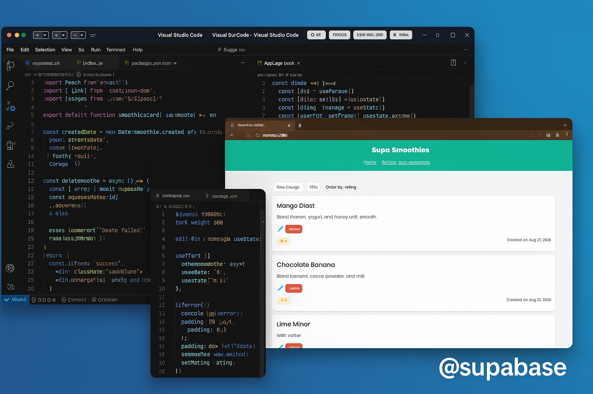

# 🥤 Smoothies App  

A simple **React + Supabase** app to manage smoothies.  
Users can **create, read, update, and delete (CRUD)** smoothies with title, method, and rating.  

---

## 🚀 Features  
- 📌 Add new smoothies (title, method, rating)  
- 📖 View all smoothies  
- ✏️ Update smoothies  
- ❌ Delete smoothies (with instant UI update)  
- 🔍 Sort smoothies by time created, title, or rating  

---

## 🛠️ Tech Stack  
- **Frontend**: React (Vite or CRA)  
- **Backend / Database**: Supabase (Postgres + Auth + Policies)  
- **Styling**: CSS  

---

## ⚡ Setup & Installation  

1. **Clone the repo**  
   ```bash
   git clone https://github.com/your-username/your-repo.git
   cd your-repo
   ```

2. **Install dependencies**  
   ```bash
   npm install
   ```

3. **Set up Supabase**  
   - Create a new project in [Supabase](https://supabase.com/)  
   - Create a table `smoothe` with columns:  
     - `id` (uuid / bigint, primary key)  
     - `title` (text)  
     - `method` (text)  
     - `rating` (int)  
     - `created_at` (timestamp, default: now())  

4. **Add your Supabase keys**  
   Create a file:  
   ```
   src/config/supabaseclient.js
   ```
   ```js
   import { createClient } from '@supabase/supabase-js';

   const supabaseUrl = "https://YOUR-PROJECT.supabase.co";
   const supabaseKey = "YOUR-ANON-KEY";

   export default createClient(supabaseUrl, supabaseKey);
   ```

5. **Run the app**  
   ```bash
   npm run dev
   ```

---

## 📷 Screenshots  



---

## 📜 License  
This project is open source under the **MIT License**.

